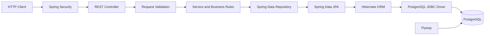

# StudioOps

StudioOps is a backend operations platform for indie game studios. It helps a studio move game ideas from early prototypes and game jams through validation, production, playtesting, marketing, and release readiness.

The project is designed as a portfolio-quality business system built with Java, Spring Boot, PostgreSQL, Docker, and GitHub Actions.

## What StudioOps Manages

- Studios, users, memberships, and role-based access
- Game ideas and their current production stage
- Game jams and playable prototypes
- Traction metrics from sources such as itch.io
- Greenlight, pivot, further-testing, and shelving decisions
- Production milestones and work items
- Task assignment, priority, status, due dates, and overdue tracking
- Playtest sessions and findings
- Marketing activities
- Release checklists and readiness
- A combined game dashboard for business and production signals

## Game Lifecycle

```text
IDEA
  -> PROTOTYPE
  -> VALIDATION
  -> PLANNING
  -> PRODUCTION
  -> PLAYTESTING
  -> MARKETING
  -> RELEASE
```

A game can also be pivoted, tested further, or shelved when validation results do not justify production.

## Architecture



## Technology Stack

| Area | Technology |
|---|---|
| Language | Java 21 |
| Framework | Spring Boot 4.0.6 |
| Web API | Spring Web MVC |
| Authentication | Spring Security with HTTP Basic |
| Persistence | Spring Data JPA and Hibernate |
| Database | PostgreSQL 16 |
| Migrations | Flyway |
| Validation | Jakarta Bean Validation |
| Health checks | Spring Boot Actuator |
| Testing | JUnit 6 and Mockito |
| Packaging | Maven Wrapper and Docker |
| CI | GitHub Actions |

## Security Model

Users authenticate with their email address and password. Passwords are stored as BCrypt hashes.

Studio data is isolated through memberships. A user only sees studios and games connected to their memberships.

Supported membership roles:

| Role | Typical access |
|---|---|
| `OWNER` | Full studio administration and production access |
| `PRODUCER` | Production planning, assignment, validation, and marketing |
| `DEVELOPER` | Development work, prototypes, milestones, playtests, and task status |
| `CONTRACTOR` | Limited membership access |

Authorization is enforced in the service layer through `PermissionService`.

## Quick Start With Docker

### Requirements

- Docker Desktop with Docker Compose
- Ports `8080` and `5432` available

### 1. Configure local environment values

Create a local `.env` file from the example:

```powershell
Copy-Item .env.example .env
```

Example local values:

```env
POSTGRES_DB=studioops
POSTGRES_USER=studioops
POSTGRES_PASSWORD=studioops
```

The `.env` file is ignored by Git. Do not commit real credentials.

### 2. Build and start the stack

```powershell
docker compose up --build -d
```

### 3. Verify the containers

```powershell
docker compose ps
```

Expected services:

```text
studioops-api
studioops-postgres
```

### 4. Check application health

```powershell
Invoke-RestMethod http://localhost:8080/actuator/health
```

Expected status:

```text
UP
```

### Useful Docker commands

```powershell
docker compose logs -f app
docker compose down
docker compose down -v
```

`docker compose down -v` deletes the PostgreSQL volume and all local data.

## Local Development

Start only PostgreSQL:

```powershell
docker compose up -d postgres
```

Run the application with Maven:

```powershell
.\mvnw.cmd spring-boot:run
```

Run the test suite:

```powershell
.\mvnw.cmd test
```

## Configuration

Spring reads deployment settings from environment variables while retaining local defaults.

| Variable | Purpose | Local default |
|---|---|---|
| `DB_URL` | JDBC connection URL | `jdbc:postgresql://localhost:5432/studioops` |
| `DB_USERNAME` | Database username | `studioops` |
| `DB_PASSWORD` | Database password | `studioops` |
| `PORT` | HTTP server port | `8080` |
| `SHOW_SQL` | Enable Hibernate SQL logging | `false` |

Inside Docker Compose, the API connects to PostgreSQL using the service hostname `postgres` rather than `localhost`.

## API Authentication

Most API routes require HTTP Basic authentication. The public registration endpoint is:

```text
POST /api/auth/register
```

Register a user with PowerShell:

```powershell
$registerBody = @{
    name = "Studio Owner"
    email = "owner@example.com"
    password = "change-this-password"
} | ConvertTo-Json

Invoke-RestMethod `
    -Method Post `
    -Uri "http://localhost:8080/api/auth/register" `
    -ContentType "application/json" `
    -Body $registerBody
```

Create a reusable Basic Auth header:

```powershell
$pair = "owner@example.com:change-this-password"
$token = [Convert]::ToBase64String(
    [System.Text.Encoding]::ASCII.GetBytes($pair)
)

$headers = @{
    Authorization = "Basic $token"
    Accept = "application/json"
}
```

## API Overview

### Authentication and studios

| Method | Route | Purpose |
|---|---|---|
| `POST` | `/api/auth/register` | Register a user |
| `POST` | `/api/auth/login` | Return the authenticated user |
| `GET` | `/api/auth/me` | Get the current user |
| `POST` | `/api/studios` | Create a studio and owner membership |
| `GET` | `/api/studios` | List studios visible to the current user |
| `POST` | `/api/studios/{studioId}/members` | Add a studio member |
| `GET` | `/api/studios/{studioId}/members` | List studio members |
| `PATCH` | `/api/studios/{studioId}/members/{userId}/role` | Change a member role |

### Games and validation

| Method | Route | Purpose |
|---|---|---|
| `POST` | `/api/games` | Create a game |
| `GET` | `/api/games` | List games visible to the current user |
| `GET` | `/api/games/{id}` | Get a game |
| `GET` | `/api/studios/{studioId}/games` | List a studio's games |
| `POST` | `/api/game-jams` | Create a game jam |
| `POST` | `/api/prototypes` | Create a prototype |
| `POST` | `/api/traction-snapshots` | Record traction metrics |
| `POST` | `/api/games/{gameId}/validation-decisions` | Record a validation decision |

### Production and release

| Method | Route | Purpose |
|---|---|---|
| `POST` | `/api/games/{gameId}/milestones` | Create a milestone |
| `PATCH` | `/api/milestones/{milestoneId}/status` | Update milestone status |
| `POST` | `/api/games/{gameId}/work-items` | Create a work item |
| `GET` | `/api/games/{gameId}/work-items` | List game work items |
| `PATCH` | `/api/work-items/{workItemId}/status` | Update task status |
| `PATCH` | `/api/work-items/{workItemId}/assignee` | Assign a studio member |
| `POST` | `/api/games/{gameId}/playtests` | Record a playtest |
| `POST` | `/api/games/{gameId}/release-checklist` | Add a release checklist item |
| `GET` | `/api/games/{gameId}/release-readiness` | Calculate release readiness |
| `POST` | `/api/games/{gameId}/marketing-activities` | Create a marketing activity |

### Dashboard

```text
GET /api/games/{gameId}/dashboard
```

The combined dashboard includes:

- Game stage and validation state
- Latest validation decision
- Latest traction snapshot
- Milestone totals and statuses
- Work item totals, statuses, and overdue count
- Latest playtest findings
- Marketing activity progress
- Release readiness and blocking items

## Work Item Example

```powershell
$body = @{
    title = "Implement player movement"
    description = "Add movement controls and collision handling."
    priority = "HIGH"
    dueDate = "2026-06-20"
} | ConvertTo-Json

Invoke-RestMethod `
    -Method Post `
    -Uri "http://localhost:8080/api/games/1/work-items" `
    -ContentType "application/json" `
    -Headers $headers `
    -Body $body
```

Work item statuses:

```text
TODO
IN_PROGRESS
BLOCKED
DONE
CANCELLED
```

Priorities:

```text
LOW
MEDIUM
HIGH
CRITICAL
```

## Database Migrations

Flyway owns the database schema. Migration files live in:

```text
src/main/resources/db/migration
```

Current migration areas include core game workflow tables, users and memberships, and work items.

Hibernate uses `ddl-auto: validate`, so entity mappings are checked against the Flyway-managed schema without modifying it automatically.

## Testing

The suite includes service-level business-rule tests and a Spring application-context test.

Covered behavior includes:

- Marketing and playtest workflow rules
- Release readiness calculations
- Dashboard aggregation
- Work item defaults, status updates, and assignment
- Rejection of cross-game milestones
- Rejection of assignees outside the studio
- Spring, JPA, Flyway, security, and PostgreSQL integration startup

Run all tests:

```powershell
.\mvnw.cmd test
```

## Continuous Integration

The GitHub Actions workflow in `.github/workflows/ci.yml` runs on pushes and pull requests.

It performs two jobs:

1. Starts PostgreSQL 16 and runs the Maven test suite.
2. Builds the StudioOps Docker image after tests pass.

## Project Structure

```text
src/main/java/org/fromdesertdev/studioops
  auth/                 Authentication endpoints
  authorization/        Membership and role checks
  dashboard/            Combined game dashboard
  game/                 Games and lifecycle state
  gamejam/              Game jam records
  marketing/            Marketing activities
  membership/           Studio membership and roles
  milestone/            Production milestones
  playtest/             Playtest sessions
  prototype/            Playable prototypes
  releasechecklist/      Release readiness
  studio/               Studio ownership
  traction/             Validation and business metrics
  user/                  Application users
  validation/            Greenlight and pivot decisions
  workitem/              Production tasks
```

## Roadmap

- Web frontend for authentication, dashboards, and task boards
- Cloud deployment with managed PostgreSQL
- OpenAPI/Swagger documentation
- Refreshable token-based authentication for browser clients
- Notifications for overdue work and blocked releases
- Audit history for role and workflow changes

## Status

The backend is functional, containerized, migration-managed, secured by studio membership, covered by automated tests, and ready for cloud deployment preparation.
